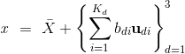

# Visualization of dominant modes of variability in 3D human faces
 
 * Objective here is to visualize the dominant modes of variability in three 3D faces mainly, and not focus on facial texture. <!-- Though, typically Active Shape Model (ASM) is used to extract the texture of the interested object with a base (template) model using an extension of eigenvector algorithm.  -->

* The attached [notbook](eigenface_3d_vz.ipynb) analyzes the variability in given data and also presents some extreme samples of 3D faces generated using eigenfaces which captures at least 98% variability in the data.  

## Dataset

 * Synthetic 3D Face of about 500 faces is available.

 * Each of the faces is represented by 7160 dimension 3D coordinates.  

## Eigen 3D Faces

 * To compute eigenfaces each of ordinate direction is handles separately. 

 * This process can result in a different number of eigenvectors for each ordinate. 

 * To select top dominant eigenfaces, the eigenvectors are trimmed according to minimum possible value. For 98% variability 15 dimensions (out of 7160) is enough to represent for this synthetic dataset. 

 * However, for generating faces no eigenvector needs to be left out since they each dimension individually combines to generate a new 3D face.

## Average 3D Face

 * The average face is mean of all the faces that also acts as template face for visualizing variability in generated 3D faces. 

## Computing Variation in Faces

<!--  -->

<!--  -->

 * where  is a new face which is generated using  eigenfaces () corresponding to each dimension () by varying magnitude of . 
 
 * Variant of faces are generated using **average face** as template and adding extreme combination of eigenvectors () to show range of faces that can be produced.  

<!-- $x \ \approx \  \bar{X}  + \sum_{i=1}^{k} b_i \mathbf{u_i} $ \\ -->

<!-- $ -3 \sqrt{\lambda} \le bi \le 3 \sqrt{\lambda} $ -->

## Conclusions
 
 * Very few eigenfaces (15) are needed to capture (98%) of variability in data. Although, the data is synthetic with not much variability in it, is also playing a role in having very few eigenfaces.

 * One can generate any number of faces using a combination of eigenfaces.   

## References

[[1]](resources/MeshMonkintensive3Dphenotyping.pdf) White, Julie D., et al. "MeshMonk: Open-source large-scale intensive 3D phenotyping." Scientific reports 9.1 (2019): 1-11.

[[2]](resources/An_Introduction_to_ActiveShapeModels.pdf) Cootes, Tim, E. R. Baldock, and J. Graham. "An introduction to active shape models." Image processing and analysis (2000): 223-248.

